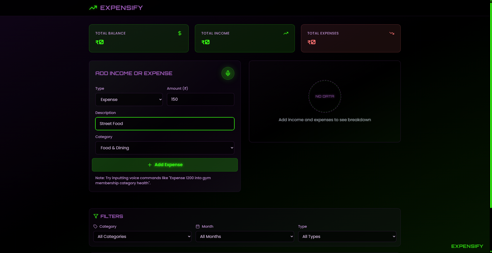
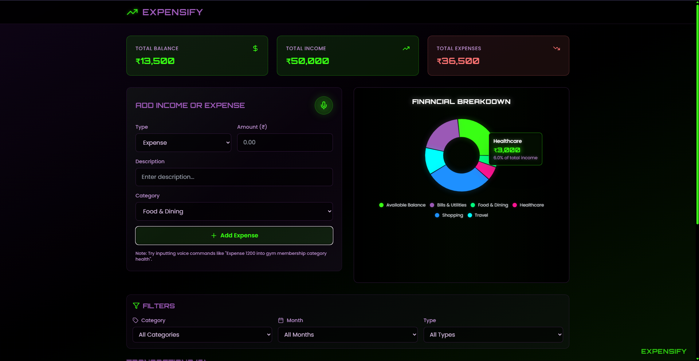
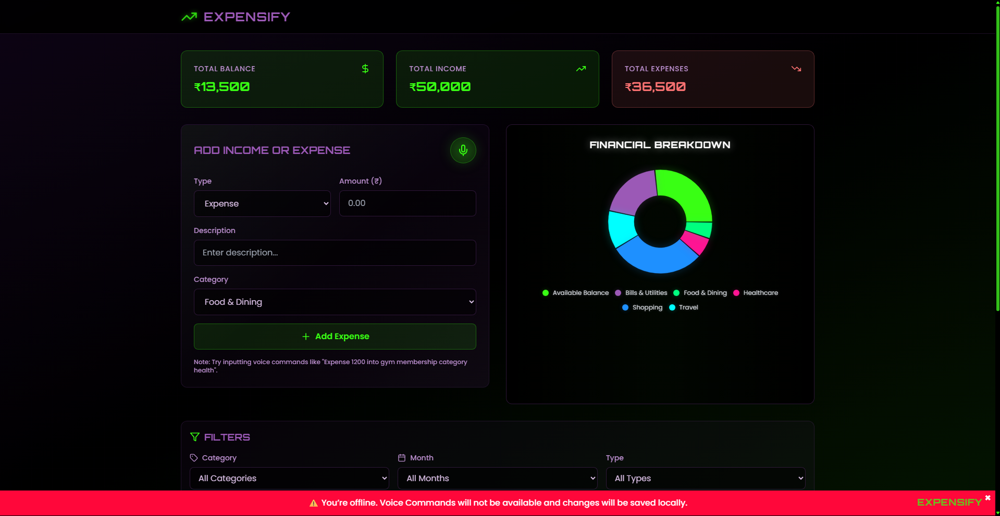
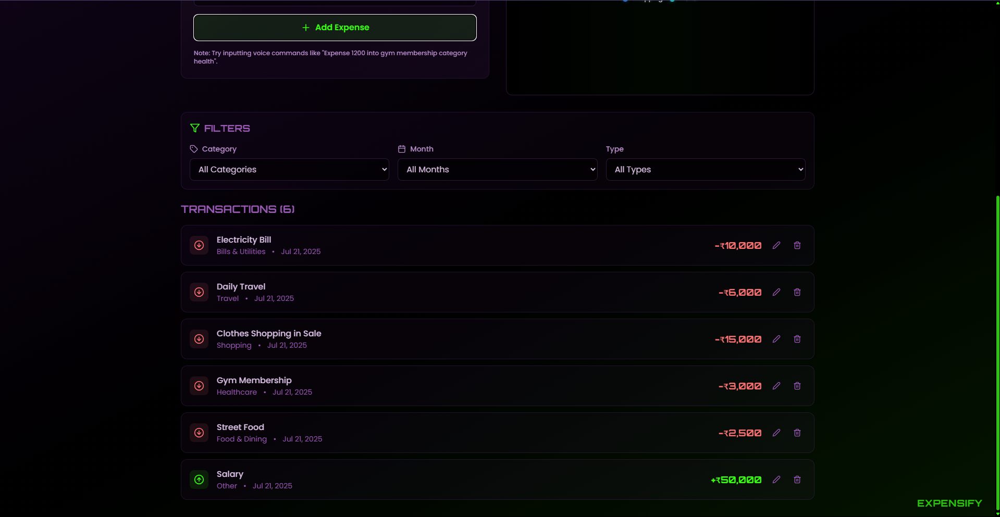
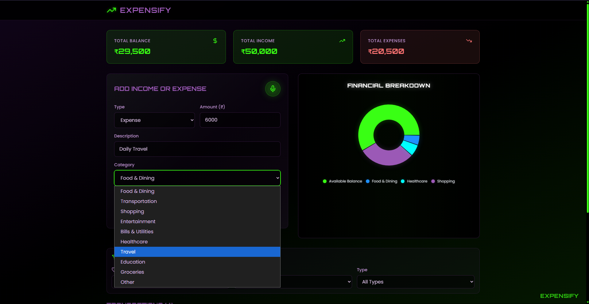
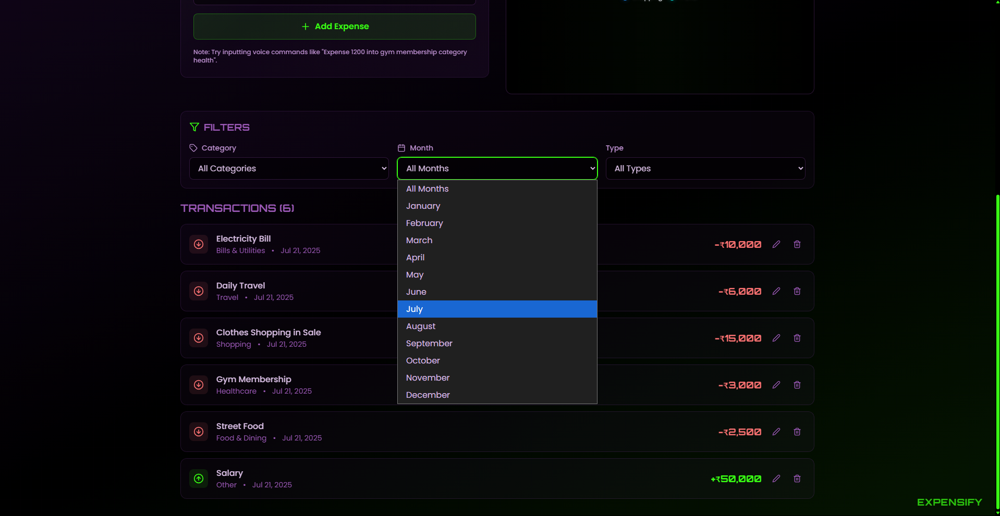
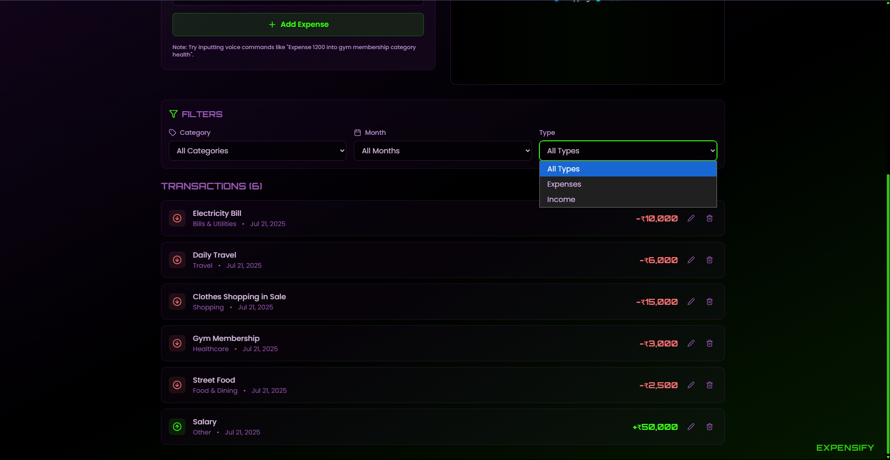
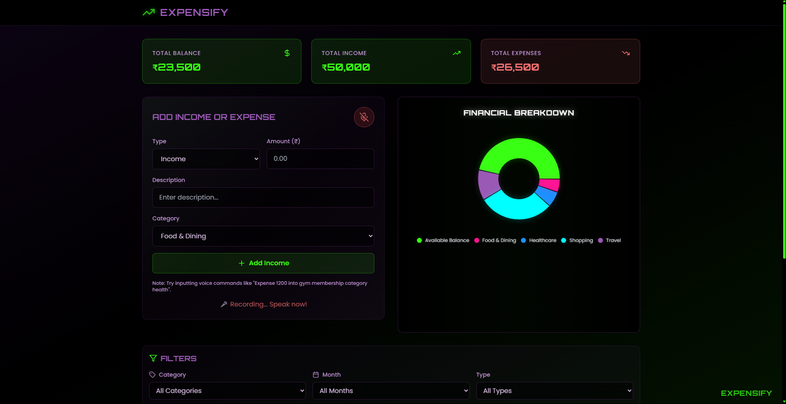
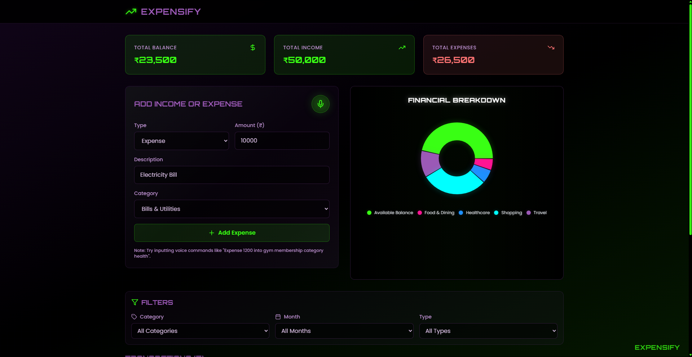

# 🧾 Expensify — Voice-Enabled Expense Tracker

**Expensify** is a sleek, voice-powered expense tracker designed to make recording income and expenses effortless. Whether you're online or offline, Expensify keeps your finances in check with smart parsing, responsive design, and local data storage — all with a neon-futuristic touch. This is a project that helps people to manage their daily and monthly expenses with a clean UI and modern features.

---

## 🚀 Features

- 🎙️ **Voice Command Input**  
  Speak naturally to record your expenses. Example:  
  _"Expense 1200 into Netflix and category entertainment"_

- 🧠 **Intelligent Parsing**  
  Detects type, amount, description, and category in one go

- 💾 **Offline Support**  
  Data persists using localStorage, even with no internet

- 🎨 **Modern Neon UI**  
  Eye-catching, responsive design with hover effects and icons

- 🔍 **Custom Category Matching**  
  Category guesses based on common phrasing and synonyms

- 🔊 **Live Mic Feedback**  
  Shows recording and processing animations while speaking

---

## 🌐 Live Demo

🔗 [**Launch the App Here**](https://expensify-voice-powered-expense-tracker.vercel.app/)  
<!-- Replace this with your actual hosted link, e.g., on Vercel or Netlify -->

---

## 🖼️ Screenshots


### 💻 Homepage: First time visit (Without any data)


### 💻 Homepage (With data)


### 💻 Homepage: Offline warning ⚠️


### 💻 Homepage: Filters section and Transactions List


### 🔍 Adding income/expenses: Categories 


### 🔍 Filters: By month of transaction


### 🔍 Filters: By type of transaction


### 🎙️ Voice Commands: Taking input of command from user (Example in this case: "Expense 10000 into Electricity Bill, category bills")


### 🎙️ Voice Commands: Adding everything automatically (According to the given example input)



---

## 📦 Tech Stack

- **React + TypeScript**
- **Tailwind CSS**
- **Vite**
- **Lucide Icons**
- **Web Speech API** for voice recognition
- **LocalStorage API** for offline support

---

## 🛠️ Installation & Local Setup

### 1. Clone the Repository

```bash
git clone https://github.com/yourusername/expensify-voice-tracker.git
cd expensify-voice-tracker
```

### 2. Install Dependencies

```bash
npm install
```

### 3. Run Locally

```bash
npm run dev
```
Now visit: http://localhost:5173

---

# 🗣️ Using Voice Input

### ✅ Supported Voice Commands

You can say things like:

```CSharp
Expense 500 into Uber ride and category transportation
Income 8000 into freelance project and category salary
Expense 250 into lunch and category food and dining
```

### Make sure to include:
- Type (expense or income)
- Amount
- Description (after "into")
- Optional: Category (after "category")

### 🎧 Tips
- Use Chrome or Edge for best voice recognition support
- Speak clearly and slowly
- Grant mic permissions to the browser
          
---

# 📦 Deployment (Optional)

If you'd like to deploy it:
- ☑️ Vercel: Just connect your GitHub repo and it works out of the box
- ☑️ Netlify: Drop the dist folder after building with npm run build
- ☑️ GitHub Pages: Use gh-pages package for deployment

---

# 💡 Future Improvements

- Export/Import data as CSV
- Add graphs and analytics
- Integrate cloud sync option
- Multilingual voice support

---

# 🤝 Contributing

Got ideas or bug fixes? Contributions are always welcome!
Just fork the repo, make your changes, and open a pull request.

---

# 📄 License

MIT License © 2025
